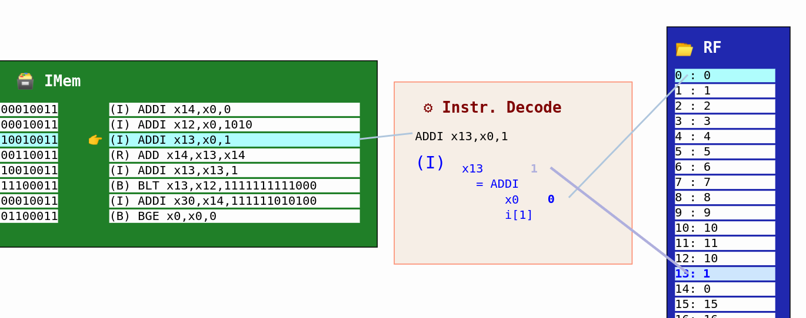
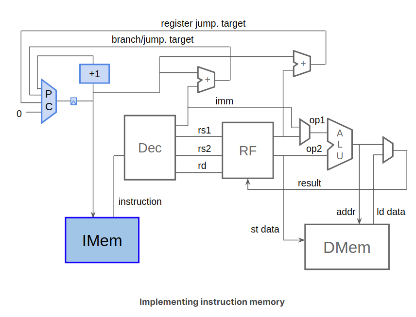
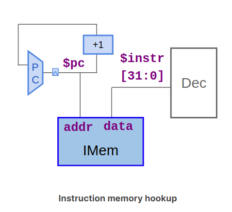
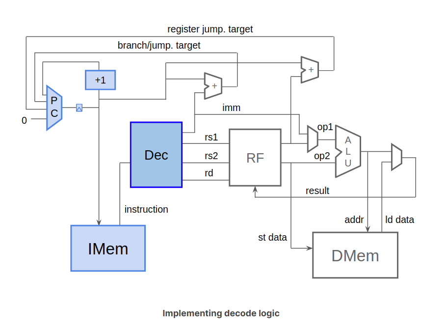
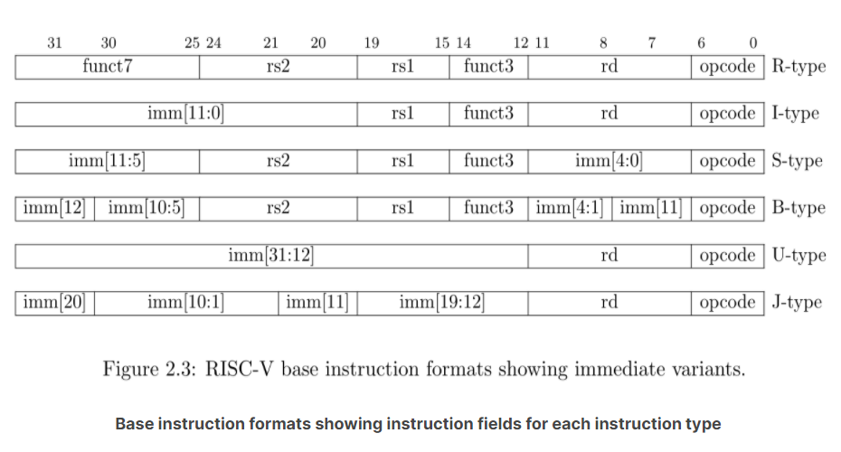
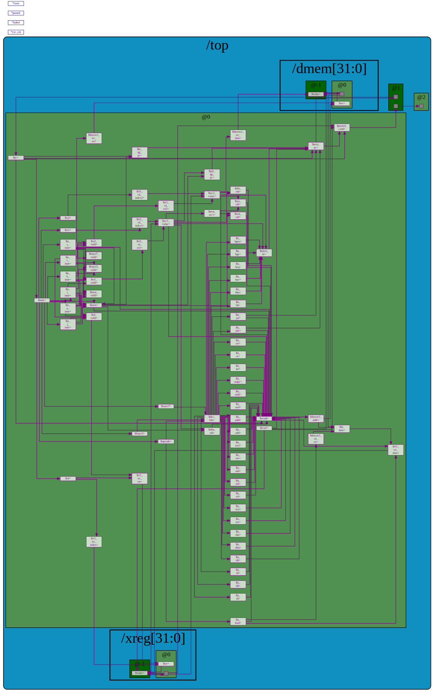

# RISC-V CPU Core in Transaction Level Verilog.

A simple implementation of a RISC-V core written in TL Verilog on Makerchip IDE.  
This implementation is based on RV32I Base instruction set.  
  
## Objectives-
- [ ] Digital logic tryouts to familiarize with TL-Verilog
- [ ] Step by step functionality incrementation from Starter code
- [ ] Final RISC-V Core(Pipelined and not-pipelined)

  

# CPU Microarchitecture and Implementation

CPUs come in many flavors, from small microcontrollers, optimized for small area and low power, to desktop and server processors, optimized for performance. Within several hours, you will construct a CPU core that could be appropriate as a microcontroller. In contrast, a desktop or server CPU chip might be built by a team of hundreds of seasoned engineers over a period of several years.

Our CPU will fully execute one instruction with each new clock cycle. Doing all of this work within a single clock cycle is only possible if the clock is running relatively slowly, which is our assumption.

We will start by implementing enough of the CPU to execute our test program. As new piece of functionality is added, you will see in the VIZ pane the behavior you implemented, with more and more of the test program executing correctly until it is successfully summing numbers from one to nine. Then we will go back to implement support for the bulk of the RV32I instruction set.

Let’s look at the components of our CPU, following the flow of an instruction through the logic. This is also roughly the order in which we will implement the logic.

## PC Logic

  

This logic is responsible for the program counter (PC). The PC identifies the instruction our CPU will execute next. Most instructions execute sequentially, meaning the default behavior of the PC is to increment to the following instruction each clock cycle. Branch and jump instructions, however, are non-sequential. They specify a target instruction to execute next, and the PC logic must update the PC accordingly.

## Fetch

  

The instruction memory (IMem) holds the instructions to execute. To read the IMem, or "fetch", we simply pull out the instruction pointed to by the PC.  
IMem is implemented here by instantiating a Verilog macro.

  

## Decode Logic

  

RISC-V defines various instruction types that define the layout of the fields of the instruction, according to this table from the RISC-V specifications [https://riscv.org/technical/specifications/]:

  

The instruction type is determined by its opcode, in $instr[6:0]. $instr[1:0] must be 2'b11 for valid RV32I instructions. Assuming all instructions to be valid, these two bits can be ignored. The ISA defines the instruction type to be determined as follows.

  
Now that we have an instruction to execute, we must interpret, or decode, it. We must break it into fields based on its type. These fields would tell us which registers to read, which operation to perform, etc.

## Register File Read  

  

The register file is a small local storage of values the program is actively working with. We decoded the instruction to determine which registers we need to operate on. Now, we need to read those registers from the register file.  

  

## Arithmetic Logic Unit (ALU)  

  

Now that we have the register values, it’s time to operate on them. This is the job of the ALU. It will add, subtract, multiply, shift, etc, based on the operation specified in the instruction.

## Register File Write  

Now the result value from the ALU can be written back to the destination register specified in the instruction.  

## DMem  

The test program executes entirely out of the register file and does not require a data memory (DMem). But no CPU is complete without one. The DMem is written to by store instructions and read from by load instructions.

We are ignoring all of the logic that would be necessary to interface with the surrounding system, such as input/output (I/O) controllers, interrupt logic, system timers, etc.

Notably, we are making simplifying assumptions about memory. A general-purpose CPU would typically have a large memory holding both instructions and data. At any reasonable clock speed, it would take many clock cycles to access memory. Caches would be used to hold recently-accessed memory data close to the CPU core. We are ignoring all of these sources of complexity. We are choosing to implement separate, and very small, instruction and data memories. It is typical to implement separate, single-cycle instruction and data caches, and our IMem and DMem are not unlike such caches.

# Final Core    
Pre-built logic diagram of the final CPU. Ctrl-click here to [explore](https://raw.githubusercontent.com/stevehoover/LF-Building-a-RISC-V-CPU-Core/main/lib/riscv.svg).  

  

## Reference

- RV32I ISA
- Building RISCV CPU Core - edX
- Makerchip IDE Tutorials

